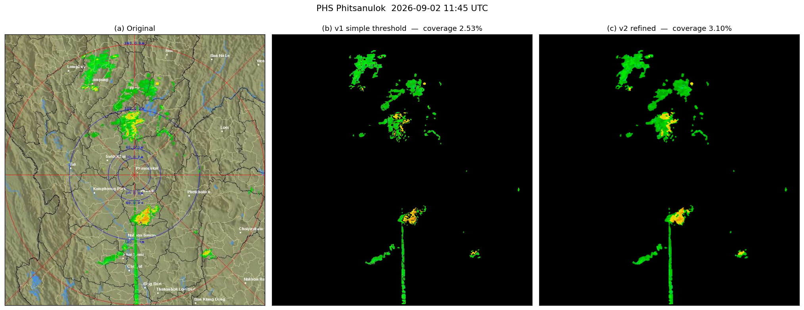
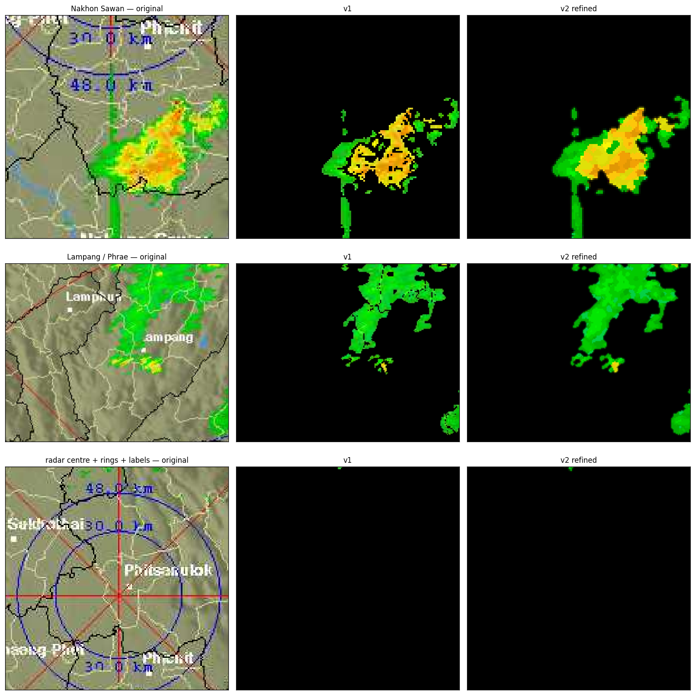
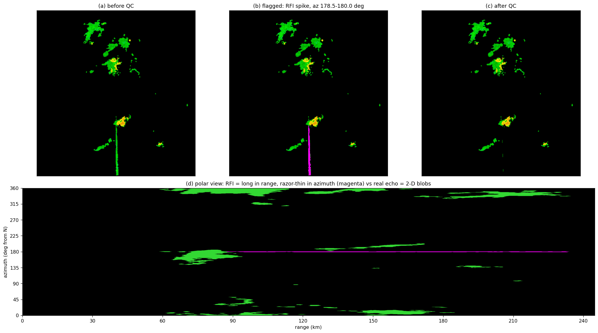
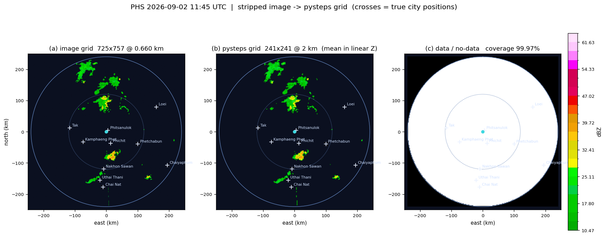

# tmd-radar-archive

เก็บภาพเรดาร์ตรวจอากาศของกรมอุตุนิยมวิทยา (TMD) แบบอัตโนมัติทุก 15 นาที
แล้วตัด background (แผนที่ / เส้นขอบ / range ring / ตัวอักษร) ออก ให้เหลือเฉพาะค่า reflectivity

สถานีเริ่มต้น: **PHS พิษณุโลก** (240 km) — เพิ่มสถานีอื่นได้ที่ `config/stations.yml`



---

## ทำไมต้องเก็บเอง

TMD เขียนทับไฟล์ `phs240_latest.jpg` ทุกรอบ **ไม่มี archive ย้อนหลังให้ดาวน์โหลด**
ข้อมูลที่เราจะมีจึงเริ่มนับจากวันที่เปิด workflow เท่านั้น — ยิ่งเริ่มเร็วยิ่งได้เยอะ

## โครงสร้าง

```
config/stations.yml        ค่า geometry + URL ของแต่ละสถานี  <- แก้ที่นี่เวลาจะเพิ่มสถานี
radar_archive/
  config.py                โหลด config
  fetch.py                 ดาวน์โหลด + อ่านเวลาจาก footer ด้วย OCR + กันไฟล์ซ้ำ
  palette.py               สกัด palette สี->dBZ จาก colorbar ในภาพเอง
  strip.py                 ตัด background พื้นฐาน
  refine.py                โหมดคุณภาพสูง (hysteresis + อุดรู + snap สี) <- ใช้เป็น default
  qc.py                    QC สัญญาณผิดปกติ: radial spike (RFI/sun) + ground clutter
  solar.py                 ตำแหน่งดวงอาทิตย์ ใช้แยก sun spike ออกจาก RFI
  grid.py                  แปลงเป็นกริด 241x241 @ 2 กม. + metadata สำหรับ pysteps
  lab.py                   rgb2lab / connected components เขียนเอง (ไม่ต้องพึ่ง scikit-image)
  pipeline.py              ร้อยทุกขั้นเข้าด้วยกัน + เขียน CSV log
  calibrate.py             ช่วยหา center/scale ของสถานีใหม่
  cli.py                   จุดเรียกใช้จาก command line / Actions
notebooks/test_strip.ipynb ตัวเรียกใช้สำหรับทดลอง/จูน tolerance บน Colab
.github/workflows/archive.yml
data/
  raw/PHS/2026/09/PHS_20260902_1145Z.jpg              ภาพต้นฉบับ (เก็บไว้เสมอ)
  processed/PHS/alpha/.../..._alpha.png               PNG พื้นหลังโปร่งใส
  processed/PHS/solid/.../..._solid.png               PNG พื้นหลังทึบ
  log/PHS_index.csv                                   index ของทุกเฟรม
  masks/PHS_palette.json, PHS_static_mask.png
```

**เวลาในชื่อไฟล์เป็น UTC เสมอ** (ลงท้ายด้วย `Z`) ส่วน CSV log มีทั้ง UTC และเวลาไทย

## วิธีตัด background

พื้นฐาน (`strip.py`)

1. crop เอาเฉพาะพื้นที่แผนที่ ตัด colorbar ซ้ายและ footer ล่างออก
2. สกัด palette จาก colorbar **ในภาพนั้นเอง** (ไม่ hardcode — ถ้า TMD เปลี่ยนสีจะปรับตาม)
   แล้วตัดแถบขาวบนสุด (>66.5 dBZ) ทิ้ง เพราะสีชนกับเส้นขอบจังหวัดและตัวอักษร
3. แปลงทุก pixel เป็น **CIELAB** แล้วหาสีที่ใกล้ที่สุดใน palette
   pixel ที่ห่างเกิน tolerance = background → ทิ้ง
   (ต้องใช้ nearest-color ไม่ใช่ exact match เพราะต้นทางเป็น JPEG มี compression artifact)
4. ลบ blob ที่เล็กกว่า `min_blob_px`
5. ลบ static overlay mask ถ้ามี — สร้างจากหลายเฟรมด้วย `cli.py mask`

### โหมด refine (`refine.py`) — เปิดเป็น default

การ threshold ตรง ๆ ให้ผลที่ "ไม่เนียน" เพราะสามเรื่องนี้

| ปัญหา | สาเหตุ | วิธีแก้ |
|---|---|---|
| ก้อนฝนแหว่ง ขอบกร่อน | pixel ขอบเป็นสีผสมระหว่าง echo กับแผนที่ (anti-alias + JPEG) ระยะสีเลยเกิน tolerance | **hysteresis** — ใช้ threshold เข้ม (`tol_core`) หาแกน แล้วขยายออกได้ไม่เกิน `grow_px` เฉพาะที่ยังผ่าน threshold หลวม (`tol_edge`) |
| เป็นรูพรุน มีรอยขีดดำผ่ากลางก้อน | เส้น range ring / ชื่อเมือง วาดทับ echo | `close_px` + อุดรูที่เล็กกว่า `fill_hole_px` |
| สีข้างในด่าง ๆ ไม่เรียบ | เก็บ RGB ดิบจาก JPEG ซึ่งเพี้ยนจาก palette | mode filter 3x3 บน band index + **snap สีให้ตรง palette เป๊ะ** |
| จุดขาวหลุดมาเป็นก้อนเล็ก ๆ | ตัวหนังสือชื่อเมืองสีขาว ถูกจับคู่กับแถบสีจางสุด | `drop_pale_blobs` — ทิ้งก้อนที่ค่ากลางอยู่ในแถบจางสุด (echo จริงที่แรงขนาดนั้นเป็นไปไม่ได้ที่จะทั้งก้อนมีค่ากลางอยู่แถบนั้น) |
| ขอบหยักเป็นขั้นบันได | mask เป็น binary | `soft_edge` — alpha ไล่ระดับเฉพาะขอบนอก |

ทำไม hysteresis ต้องจำกัดระยะขยาย: เส้นขอบจังหวัดสีขาวห่างจากแถบสีจางสุดแค่ ~20 ใน Lab
ถ้าปล่อยให้ขยายไม่จำกัด (morphological reconstruction เต็มรูปแบบ) พอเส้นนั้นพาดผ่าน echo
สักจุดเดียว มันจะไหลไปตามเส้นทั้งเส้นทันที การขยายทีละ pixel ไม่เกิน 2-3 ครั้งจึงจำเป็น

ผลกับเฟรมทดสอบ: coverage 2.53% → 3.10% (ที่เพิ่มคือขอบที่เคยถูกกัดหายกับรูที่เคยโดนเจาะ)

จูนพารามิเตอร์ทั้งหมดได้ที่ `defaults.refine_params` ใน `config/stations.yml`
หรือปิดโหมดนี้ด้วย `refine: false` ถ้าอยากได้ mask ดิบแบบ threshold ตรง ๆ



## QC สัญญาณผิดปกติ (`qc.py`)



### 1. radial spike (RFI / sun spike)

เส้นตรงยาวพุ่งออกจากสถานีตามแนวรัศมี — เกิดจากคลื่นรบกวนภายนอก (Wi-Fi 5 GHz,
microwave link) หรือรับรังสีจากดวงอาทิตย์โดยตรงตอนดวงอาทิตย์อยู่ต่ำใกล้ขอบฟ้า

**ลายเซ็นที่ใช้แยกออกจากฝนจริง: ยาวมากในแนวรัศมี แต่แคบมากในแนวมุมกวาด**
ที่ระยะ 200 km มุม 0.5° กว้างแค่ ~1.7 km — ไม่มีระบบฝนจริงที่กว้าง 2 km แล้วยาว 150 km
พาดตรงเป๊ะผ่านจุดตั้งสถานีพอดี ทดสอบในพิกัด polar จึงแยกได้แน่นอนกว่าทดสอบในภาพปกติ

ขั้นตอน

1. แปลง mask เป็นพิกัด polar รอบจุดตั้งสถานี (720 มุม × ทุก range bin)
2. หา **azimuthal support** ของทุก pixel: ที่ระยะเดียวกัน มุมข้างเคียง ±2.5°
   (เว้นตัวเองกับเพื่อนติดกัน) มี echo กี่ %
3. pixel ที่ support < 0.35 = โดดเดี่ยวในแนวมุมกวาด
4. เก็บเฉพาะที่ต่อกันยาวในแนวรัศมีเกิน 40 km → นั่นคือ spike
5. ขยายด้านข้างอีกเล็กน้อยเพื่อเก็บขอบเส้น แต่เข้าได้เฉพาะที่ support ยังต่ำ

ข้อ 5 คือเหตุผลที่ **ก้อนฝนที่เส้นพาดผ่านไม่หายไปด้วย** — ตรงก้อนฝน support สูง
อัลกอริทึมจึงหยุดตรงขอบก้อนพอดี (ดูรูป (b): magenta หยุดตรงฐานของก้อนนครสวรรค์)

จากนั้นเทียบมุมของ spike กับ**ตำแหน่งจริงของดวงอาทิตย์** (`solar.py`, สูตร NOAA)
ถ้าตรงกับทิศดวงอาทิตย์ตอน elevation อยู่ราว -1.5 ถึง 5° → บันทึกเป็น `sun`
ไม่ตรง → `rfi` การแยกไว้ตั้งแต่ต้นทำให้เขียนรายงาน QC ในเปเปอร์ได้ว่าตัดอะไรด้วยเหตุผลอะไร

เฟรมทดสอบ 2026-09-02 11:45 UTC: เจอ spike ที่ az 178.5-180.0° ยาว ~90-235 km
ตัดออก 1,698 px (10.2% ของ echo) จัดประเภทเป็น `rfi` ถูกต้อง — เพราะเวลานั้น
ดวงอาทิตย์อยู่ที่ az 279° (ตะวันตก) ไม่ใช่ 180°

### 2. ground clutter / AP / RFI ประจำที่

ใช้สถิติเวลาจาก archive ที่เราเก็บเอง: **ฝนเคลื่อนที่เสมอ** ถ้า pixel ไหนถูกจัดว่ามี
echo เกิน 60% ของเฟรมทั้งหมด แปลว่าไม่ใช่ฝน

```bash
python -m radar_archive.cli clutter --n 200     # ต้องมีอย่างน้อย 30 เฟรม
```

สร้าง `data/masks/PHS_clutter_freq.npy` แล้ว pipeline จะหยิบไปใช้อัตโนมัติทุกเฟรมถัดไป
มีการ์ดกันพลาดไว้: ถ้าเฟรมน้อยกว่า 30 จะไม่ยอมสร้างให้ เพราะ clutter map ที่มาจาก
เฟรมน้อยเกินไปจะกลายเป็น "ลบฝนทิ้งทั้งภาพ" ควรรอให้เก็บครบอย่างน้อย 2-3 วัน
และรันซ้ำเป็นระยะเมื่อข้อมูลมากขึ้น

### 3. หลักการที่ยึดไว้

- **QC ไม่แตะภาพ raw** — เก็บ JPEG ต้นฉบับครบทุกเฟรมเสมอ ปรับอัลกอริทึมแล้ว
  `reprocess` ย้อนหลังได้ตลอด
- **ทุกอย่างที่ตัดออกถูกบันทึกลง CSV** — `qc_spike_px`, `qc_spike_az`, `qc_spike_type`,
  `qc_clutter_px`, `qc_removed_px`, `qc_removed_pct` ต่อเฟรม ตรวจสอบย้อนหลังได้
  และเอาไปเขียนใน methodology ของเปเปอร์ได้ตรง ๆ
- ปิด QC ได้ด้วย `qc: false` ใน `config/stations.yml`

### ข้อจำกัดที่ต้องยอมรับ

QC ที่ดีที่สุดต้องใช้ข้อมูลดิบ — ρhv จาก dual-pol, texture ของ Doppler velocity,
spectrum width, clutter mitigation decision (CMD) — ซึ่งภาพจากเว็บไม่มีให้
สิ่งที่ทำได้จากภาพจึงเป็น QC เชิงเรขาคณิตกับเชิงสถิติเวลาเท่านั้น
กรณีที่ยังจับไม่ได้: AP ที่เกิดเป็นครั้งคราวและมีรูปร่างเหมือนฝน, second-trip echo
ที่กว้างพอ, และ bright band — ต้องดูด้วยตาหรือใช้ข้อมูลดิบ

## ใช้งาน

**ต้องใช้ Python 3.9 ขึ้นไป** (GitHub Actions รันด้วย 3.11) และ **แยก virtual environment
ของโปรเจกต์นี้เสมอ** อย่าติดตั้งทับ environment หลักที่มี Py-ART / pysteps อยู่ —
venv ตัดทั้ง system และ user site-packages ออก จึงไม่มีทางไปชนกับของเดิม

```bash
# Windows
py -0                      # ดูก่อนว่ามีเวอร์ชันไหนบ้าง
py -3.12 -m venv .venv     # หรือ py -3.9 -m venv .venv ถ้ามีแค่ 3.9
.\.venv\Scripts\python.exe -m pip install -r requirements.txt

# Linux / macOS
python3 -m venv .venv && ./.venv/bin/pip install -r requirements.txt

sudo apt-get install tesseract-ocr        # ใช้อ่านเวลาจาก footer (ไม่มีก็รันได้ แต่จะใช้ file-mtime แทน)

# ดึงเฟรมล่าสุด 1 ครั้ง
python -m radar_archive.cli fetch

# ดึงแบบวนเช็ก 4 รอบ ห่างกัน 3 นาที (แบบที่ Actions ใช้)
python -m radar_archive.cli fetch --repeat 4 --interval 180

# ทดสอบด้วยไฟล์ในเครื่อง ไม่ต้องต่อเน็ต
python -m radar_archive.cli --station PHS fetch --from-file sample.jpg --force

# ประมวลผล raw ที่เก็บไว้ใหม่ทั้งหมด (หลังจูน tolerance หรืออัปเดต mask)
python -m radar_archive.cli reprocess --since 2026-09-01

# สร้าง static overlay mask จาก 40 เฟรมที่เก็บไว้ (ทำหลังเก็บได้สัก 2-3 วัน)
python -m radar_archive.cli mask --n 40

# สร้าง clutter frequency map สำหรับ QC (ต้องมีอย่างน้อย 30 เฟรม)
python -m radar_archive.cli clutter --n 200

# หา geometry ของสถานีใหม่
python -m radar_archive.calibrate CRI cri240_latest.jpg 240
```

## ตั้งค่าบน GitHub

1. **สร้าง repo แบบ public** — GitHub Actions ฟรีไม่จำกัดนาทีสำหรับ public repo
   ถ้าเป็น private จะกิน quota เกิน 2,000 นาที/เดือนภายในไม่กี่วัน
2. Settings → Actions → General → Workflow permissions → **Read and write permissions**
3. (ทางเลือก แต่แนะนำ) ตั้ง Google Drive เป็น archive ตัวจริง:
   - สร้าง rclone remote ชื่อ `gdrive` ในเครื่อง (`rclone config`) แล้ว
     `base64 -w0 ~/.config/rclone/rclone.conf`
   - เอาผลไปใส่ Settings → Secrets and variables → Actions → **New secret**
     ชื่อ `RCLONE_CONF`
   - ตั้ง variable `DRIVE_REMOTE` เช่น `gdrive:TMD_Radar_Archive` (ไม่ตั้งก็ใช้ค่านี้)
   - เมื่อมี `RCLONE_CONF` แล้ว workflow จะ sync ขึ้น Drive และ **prune ไฟล์เก่ากว่า 7 วัน**
     ออกจาก repo อัตโนมัติ (ถ้ายังไม่ตั้ง จะเก็บทุกอย่างไว้บน repo และไม่ลบอะไรเลย)

### เรื่องความตรงเวลาของ cron

GitHub Actions cron **ไม่การันตีเวลา** ช่วง peak หน่วงได้ 5-15 นาที
workflow จึงตั้ง `*/15` แล้วให้แต่ละ job วนเช็ก 4 รอบห่างกัน 3 นาที (ครอบคลุม ~9 นาที)
บวกกับการกันไฟล์ซ้ำด้วย timestamp จาก OCR ทำให้ยิงซ้ำได้โดยไม่เกิดข้อมูลซ้ำ

ถ้ายังพลาดเฟรมอยู่ ยังมีทางสำรอง: `loop_gif` ของ TMD เก็บย้อนหลังได้ราว 1-2 ชม.
แกะเฟรมออกมาแล้ว ingest ด้วย `fetch --from-file` ได้

## ข้อจำกัดที่ควรรู้

- ข้อมูลที่ได้เป็น **ภาพ ไม่ใช่ข้อมูลดิบ** — ค่าถูก quantize ตามแถบสี (~2.5 dBZ)
  และ colorbar ของ TMD มีบางช่วงที่สีซ้ำกัน (ราว 44-51 dBZ) จึงมี ambiguity
  → ใช้ทำ nowcasting / tracking / คัดวันเคสได้ดี แต่ไม่เหมาะทำ QPE เชิงปริมาณ
- เป็น PPI ที่ elevation 0.5° sweep เดียว ไม่ใช่ CAPPI หรือ composite
- ขอบซ้ายของแผนที่ถูก colorbar บังไปราว 7 km — พื้นที่ทางตะวันตกสุดหายไปเล็กน้อย
- **artifact ในข้อมูลต้นทาง**: เส้นตรงพุ่งออกจากจุดตั้งสถานีตามแนวรัศมี เป็น RFI/sun spike
  ของตัวเรดาร์เอง ไม่ใช่ overlay ของแผนที่ — จัดการแล้วใน `qc.py` (ดูหัวข้อ QC ข้างบน)

## georeference — ตรวจสอบแล้ว ไม่ใช่ค่าที่เดา

**ภาพ PPI ของ TMD เป็น azimuthal equidistant รอบจุดตั้งสถานี** ยืนยันด้วยการฟิตวงรัศมีทั้ง 4 วง
(`python -m radar_archive.calibrate PHS <ภาพ>`)

| ตรวจอะไร | ผล | แปลว่า |
|---|---|---|
| วงรัศมีเป็นวงกลมไหม | rms 0.88 px | เป็นวงกลม → projection สมมาตรรอบสถานี |
| รัศมีแปรผันตรงกับระยะไหม | สเกลจาก 4 วงต่างกัน 0.64% | equidistant จริง → แปลง pixel→กม. เชิงเส้นได้ |
| ตำแหน่งเมืองตรงไหม | median error **0.77 กม.** (10 เมือง) | ประมาณ 1 pixel ต้นทาง |

| ค่า | ที่ใช้ | หมายเหตุ |
|---|---|---|
| center_px (ภาพเต็ม) | 436.01, 391.29 | จากการฟิตวง ไม่ใช่กะด้วยตา |
| km_per_px | 0.66011 | 240 กม. = 363.4 px |
| lat, lon | 16.7765, 100.2161 | ฟิตจากตำแหน่งเมือง |

> ⚠️ **ค่าชุดแรกที่ใช้ตอนต้นโปรเจกต์ผิด** — km_per_px 0.6441 (ผิด 2.5%) และ lon 100.2761
> (ผิด 6.4 กม.) รวมกันแล้วเพี้ยนหลายกิโลเมตรที่ขอบโดเมน ค่าที่ถูกต้องมาจากการวัด ไม่ใช่การกะ
> ถ้าเห็นเลขชุดเก่าที่ไหนให้ถือว่าใช้ไม่ได้

## ส่งต่อให้ pysteps (`grid.py`)

pysteps ไม่เคยอ่านไฟล์เรดาร์เอง มันรับ **อาร์เรย์ 2 มิติเป็นลำดับเวลา + metadata dict** เท่านั้น
งานที่ Py-ART ทำในท่อของ CRI (อ่าน UF → QC → polar เป็น Cartesian) TMD ทำมาให้แล้วก่อนเรนเดอร์ภาพ
โมดูลนี้จึงเสียบแทน `build_cappi_stack()` ได้ตรง ๆ **โค้ดหลังจากนั้นใช้ของเดิมได้ทั้งหมด**

```python
from radar_archive import grid
d   = grid.dbz_field(res, st, pal_dbz)      # dBZ ในพิกัดภาพ
g   = grid.to_grid(d, st, agg="mean")       # 241x241 @ 2 กม. เฉลี่ยใน linear Z
meta= grid.station_meta(st)                 # metadata dict ครบทุก key ที่ pysteps ใช้
ok, gaps = grid.check_regular(times)        # pysteps สมมติว่าเฟรมห่างเท่ากัน — ต้องเช็ค
```

**ข้อตกลงเรื่องค่าในอาร์เรย์** (เอกสาร pysteps เตือนว่า NaN กับ 0 ห้ามปนกัน)

- `NaN` = ไม่มีข้อมูล (นอกรัศมี 240 กม.)
- `0.0 dBZ` = มีข้อมูลแต่ไม่มีฝน — ขีดล่างของ colorbar คือ 10.5 dBZ = **0.075 มม./ชม.**
  ซึ่งต่ำกว่าเกณฑ์วิเคราะห์มาตรฐาน 0.1 มม./ชม. (= 11.98 dBZ) อยู่แล้ว จึงไม่มีอะไรหายไป
- แถวที่ 0 = ใต้สุด (`yorigin='lower'`) ตรงกับกริดของ Py-ART — ถ้าสลับ แกน v ของสนามลมจะกลับทิศโดยไม่มี error

**ทำไมเฉลี่ยใน linear Z ไม่ใช่ใน dBZ** — dBZ เป็นสเกลลอการิทึม เฉลี่ยตรง ๆ ได้ค่าต่ำกว่าความจริงเสมอ
ผลพลอยได้: การเฉลี่ย ~9 pixel ต่อเซลล์ช่วยลด quantization noise จากแถบสี ซึ่งไม่งั้นจะไปโผล่ที่ wavenumber สูง

ผลกับเฟรมทดสอบ: coverage ในรัศมี **99.97%** · ค่าสูงสุดคงเดิม 40.9 dBZ · เซลล์ที่มี echo 1,746 จาก 45,239



## dependency — ตั้งใจให้น้อยที่สุด

`requests · numpy · Pillow · scipy · PyYAML · pytesseract` เท่านั้น

**ตัด scikit-image ออกแล้ว** ทั้งที่ตอนแรกใช้ เพราะ

1. skimage ดึง **matplotlib** เข้ามาตอน import (ผ่าน `_dependency_checks`) ทำให้ท่อของเรา
   ไปผูกกับ matplotlib โดยไม่ได้ตั้งใจ เครื่องไหนมี matplotlib เก่าที่คอมไพล์กับ NumPy 1.x
   ระบบจะพังตั้งแต่ import ด้วย `AttributeError: _ARRAY_API not found` ซึ่งไม่เกี่ยวกับงานเราเลย
2. signature ของ skimage เปลี่ยนบ่อย — `remove_small_objects`, `remove_small_holes`,
   `binary_closing` เปลี่ยนหมดในรอบปีเดียว เป็นความเสี่ยงที่ไม่ควรมีในระบบที่รันเองทุก 15 นาที

ที่ใช้จริงมีแค่ `rgb2lab`, `label`, `regionprops` (เอาแค่ median), `disk` และการอุดรู —
เขียนเองใน `lab.py` ~100 บรรทัด **ตรวจแล้วว่าให้ผลตรงกับ skimage**: rgb2lab ต่างสูงสุด
0.0002 หน่วย Lab (tolerance ที่ใช้จริงคือ 8-16) และ `label` แบ่งก้อนเหมือนกันทุกประการ
ผลลัพธ์ของทั้งท่อออกมาเท่าเดิมเป๊ะทุกตัวเลข

## ที่มาของข้อมูล

ภาพจาก https://weather.tmd.go.th/phs.php (กรมอุตุนิยมวิทยา)
ใช้เพื่อการศึกษาวิจัย — อ้างอิงแหล่งที่มาทุกครั้งที่นำไปเผยแพร่
